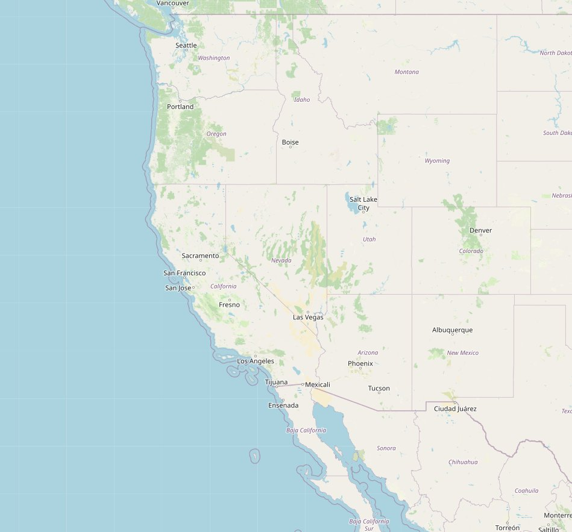
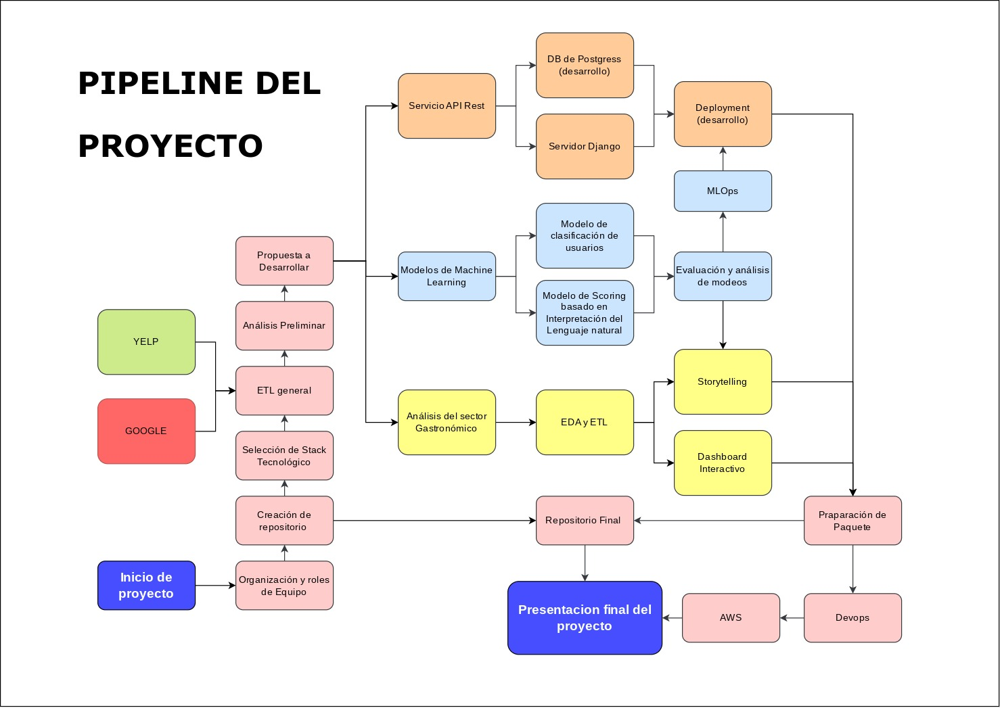
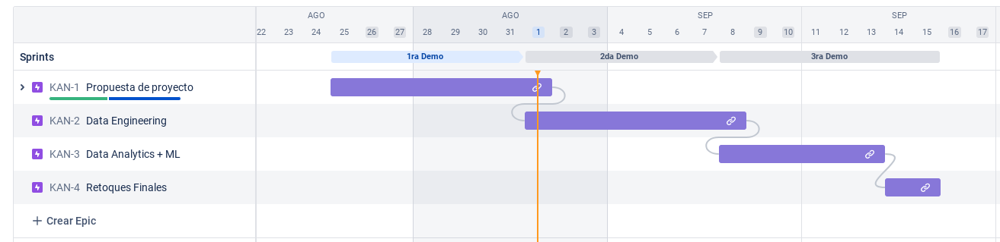

# <h1 align="CENTER">**`Market Analysis Project Google`**</h1>

## <h2 align="CENTER">**`Freag data consultant`**</h2>

<p align='center'>

<p>

---

<details>
  <summary>Tabla de Contenidos</summary>
  <ol>
    <li><a href="#introducción">Introducción</a></li>
    <li><a href="#paquete-tecnológico-analítico">Paquete Tecnológico-Analítico</a></li>
    <li><a href="#conclusiones-del-proyecto">Conclusiones</a></li>
    <li><a href="#desarrollo-del-proyecto">Desarrollo del Proyecto</a></li>
    <li><a href="#desarrolladores">Desarrolladores</a></li>
    <li><a href="#stack-tecnológico">Stack Tecnológico</a></li>
  </ol>
</details>

---

## <div align="CENTER">**`Introducción`**</div>

Somos una consultoría de análisis de datos que está desarrollando un nuevo paquete de servicios enfocado en mejorar el rendimiento de locales del sector gastronómico. Este paquete está diseñado para ayudar a los restaurantes a aumentar su popularidad, mejorar su servicio al cliente y aumentar sus ventas.

Dicho paquete está siendo evaluada para ser implementada en una cadena de restaurantes en el estado de Nevada. Y para la evaluación del produlto, estos servicios están siendo evaluados poniéndolos en ejecución en 10 restuarantes selectos de forma aletoria en el estado de Nevada y estados fronterizos: Óregon, Idaho, California, utah y Arizona.

<div align="CENTER">
  
  <p>Zona Demografica a Evaluar<p>
</div>

EL criterio para la selección de restaurantes fue su popularidad o rendimiento en sitios webs de Reseñas y críticas, para así comparar lo que nuestro paquete de servicios puede lograr en dichos restaurantes de bajo rendimeinto enfréntandolos contra aquellos que si tienen buen rendimiento.

El paquete incluye los siguientas soluciones:

- **Servicio API REST:** servicio para la obtención de competidores y usuarios: Esta API proporcionará a los restaurantes datos sobre sus competidores y sus clientes. Los datos de los competidores se utilizarán para identificar oportunidades de crecimiento y diferenciación. Los datos de los clientes se utilizarán para personalizar las campañas de marketing y mejorar el servicio al cliente.

- **Modelos de machine learning:** Se crearán dos modelos de machine learning utilizarán los datos de los competidores y los clientes para proporcionar información y recomendaciones valiosas a los restaurantes. El modelo de clasificación de usuarios identificará a los clientes potenciales que son más propensos a participar en campañas de marketing. El modelo de lenguaje natural analizará las reseñas de los clientes para proporcionar información sobre la satisfacción de los clientes y las áreas de mejora del restaurante.

- **Análisis y dashboard interactivo:** Este análisis proporcionará a los restaurantes una visión general de su rendimiento y les ayudará a identificar áreas de mejora. El dashboard interactivo será fácil de usar y proporcionará información visual atractiva.

Este paquete inicialmente se alimentará de datos obtenidsos de fuentes YELP y Google. Ambos servicios proporcionan información de localidades, y reseñas, y el análisis de sus datos nos permitirá proporcionar un análisis detallado del sector gatronómico y la evaluación preliminar de nuestros paquete de servicios.

---

## <h2 align="CENTER">**`Paquete Tecnológico-Analítico`**</h2>

El paquete ofrece la realización de tres soluciones tecnológicas enfocadas a tres diferentes contextos: información de competidores, determinación de potenciales clientes, y soluciones de marquetin y analítica.

Estos productos son los siguientes:

### Servico API REST

Con tla de poder obtener informacion de los competidores de nuestro cliente, se desarrollara un Servicio Api REST Ful para obtentener. Este servicio se desplejara en la web, ynuestro cliente podra acceder a el para obtener informacion reeavante de la empresa.

#### Restaurante por id

<details>
  <summary>
    <code>GET</code>
    <code><b>/api/restaurant/ {restaurant_id} </b></code>
  </summary>

<br>

```txt
Este endpoint permite obtener información detallada de un restaurante por su ID.
```

#### Ejemplo de Uso

```txt
/api/restaurantes_id/0x80dd2786e6991525:0xfe0e4b2bc470d043/
```

#### Ejemplo de Respuesta

```json
{
  {
    "restaurant_id": "0x80dd2786e6991525:0xfe0e4b2bc470d043",
    "name": "Hippo Loco",
    "address": "Hippo Loco, 16519 Magnolia St, Westminster, CA 92683",
    "latitude": 33.7227071,
    "longitude": -117.9725644,
    "rating": "5.00",
    "review_count": 6,
    "categories": "['Restaurant']"
}
}
```

</details>

#### Lista de Competidores Cercanos

<details>
  <summary>
    <code>GET</code>
    <code><b>//api/restaurantes_en_radio/ {restaurant_id }/{km2}</b></code>
  </summary>

<br>
```txt
Este endpoint permite obtener una lista de restaurantes competidores cercanos a uno específico en un radio dado.
```

#### Ejemplo de Uso

```txt
/api/restaurantes_en_radio/0x80dd2786e6991525:0xfe0e4b2bc470d043/1/
```

#### Ejemplo de Respuesta

```json
[
  {
    "restaurant_id": "0x80c2bd16e61206a1:0xfb13d068c2ef35b2",
    "name": "Baja California Tacos - Broxton",
    "address": "Baja California Tacos - Broxton, 935 Broxton Ave, Los Angeles, CA 90024",
    "latitude": 34.062997,
    "longitude": -118.447253,
    "rating": "3.50",
    "review_count": 18,
    "categories": "['Restaurant']"
  },
  {
    "restaurant_id": "0x80dc713918f62867:0xdcb64167bf937fda",
    "name": "Fat BBQ Shack Express",
    "address": "Fat BBQ Shack Express, 2601 Oceanside Blvd, Oceanside, CA 92054",
    "latitude": 33.2007634,
    "longitude": -117.3434913,
    "rating": "4.80",
    "review_count": 74,
    "categories": "['Restaurant']"
  },
  {
    "restaurant_id": "0x80c32a59fda495e1:0xa1f8d76c937d7e0a",
    "name": "Coconut Bay Bar & Grill",
    "address": "Coconut Bay Bar & Grill, 18922 Gale Ave, Rowland Heights, CA 91748",
    "latitude": 33.9957215,
    "longitude": -117.889782,
    "rating": "3.70",
    "review_count": 15,
    "categories": "['Thai restaurant', 'Restaurant']"
  },
  {
    "restaurant_id": "0x80c34f832ca90dd9:0x351eb6a65d8a9870",
    "name": "Gru",
    "address": "Gru, 18291 Cajon Blvd, San Bernardino, CA 92407",
    "latitude": 34.2222088,
    "longitude": -117.4053306,
    "rating": "2.60",
    "review_count": 5,
    "categories": "['Restaurant']"
  },
  {
    "restaurant_id": "0x80c2bec04aade0e7:0xf667a0dae0628311",
    "name": "Katsu sando",
    "address": "Katsu sando, 8162 Sunset Blvd, Los Angeles, CA 90046",
    "latitude": 34.0973286,
    "longitude": -118.36667,
    "rating": "4.90",
    "review_count": 8,
    "categories": "['Restaurant']"
  }
]
```

</details>

#### Reviews por restaurante

<details>
  <summary>
    <code>GET</code>
    <code><b>/api/restaurantes_reviews/ {str:restaurant_id} / </b></code>
  </summary>

<br>

```txt
Este endpoint permite obtener las reseñas de un restaurante por su ID.
```

#### Ejemplo de Uso

```txt
/api/restaurantes_reviews/9OG5YkX1g2GReZM0AskizA/
```

#### Ejemplo de Respuesta

```json
[
  {
    "review_id": 391944,
    "rating": 4,
    "text": "Great bar Happy Hour 4-7 every day. Wine & Drafts $3, $5 pizza, $4.50 apps. To-go Dinners and lunches are very reasonable and fast. Staff are as friendly as it gets.",
    "time": "2016-01-30",
    "user": "f10WH1fXhy-68r4AEEhAWA",
    "restaurant": "9OG5YkX1g2GReZM0AskizA"
  },
  {
    "review_id": 391945,
    "rating": 5,
    "text": "Great bar Happy Hour 4-7 every day. Wine & Drafts $3, $5 pizza, $4.50 apps. To-go Dinners and lunches are very reasonable and fast. Staff are as friendly as it gets.\n\nLove the HH Pizzas. A flatbread style thin crust pepperoni and only  $5.  Peroni, Sam Adams Seasonal, Icky and BudLite on tap.",
    "time": "2016-02-27",
    "user": "f10WH1fXhy-68r4AEEhAWA",
    "restaurant": "9OG5YkX1g2GReZM0AskizA"
  },
  {
    "review_id": 391946,
    "rating": 1,
    "text": "Please, this place makes a semi-new menu and raised their prices. The food is very mediocre. i just started cooking and i make a couple pasta dishes which include spaghetti and lemon chicken piccatta.  As a beginner in cooking I can judge this place's food is horrible. A day after the food looked like it had been out for weeks. Good food can last for a day or two.When i went in there to eat the hostess was nice. first, we ordered a glass a wine. he poured the wine, missed the glass and some spilled on the table and he just ignored it. hello. idiot. waitressing 101. go back. well needless to say. not worth your money at all. ive been there during happy hour with girlfriends and its fine. not a 'high end' restaurant by any means even though they try to make it that way.",
    "time": "2013-04-11",
    "user": "-TbX3AYOIEyo6-b67MT8eA",
    "restaurant": "9OG5YkX1g2GReZM0AskizA"
  },
  {
    "review_id": 391947,
    "rating": 1,
    "text": "Food showed up cold, salmon was raw inside, plastic in the dessert, fatty lamb chops and some sort of stringy thing at the bottom of my wine glass!! The service was great though.",
    "time": "2016-04-23",
    "user": "mR1GTyurdcuhq7LE90V2Eg",
    "restaurant": "9OG5YkX1g2GReZM0AskizA"
  },
  {
    "review_id": 391948,
    "rating": 5,
    "text": "Troy and his staff always make it a really good time at the Macaroni Grill I've been here several times for birthdays and special events they've always taken care of us.\nFantastic food fantastic people.\nNever had a bad time here.",
    "time": "2017-04-30",
    "user": "zira3StlLXuENbbnTvNhMg",
    "restaurant": "9OG5YkX1g2GReZM0AskizA"
  }
]
```

</details>

#### Usuario

<details>
  <summary>
    <code>GET</code>
    <code><b>/api/usuarios/ {str:user_id} /</b></code>
  </summary>

<br>

```txt
Este endpoint permite obtener información de un usuario por su ID.
```

#### Ejemplo de Uso

```txt
/api/usuarios/f10WH1fXhy-68r4AEEhAWA
```

#### Ejemplo de Respuesta

```json
{
  "user_id": "f10WH1fXhy-68r4AEEhAWA",
  "name": "Brian"
}
```

</details>

---

### Modelos de Machine Learning

Con tla de poder obtener informacion de los competidores de nuestro cliente, se desarrollara un Servicio Api REST Ful para obtentener. Este servicio se desplejara en la web, ynuestro cliente podra acceder a el para obtener informacion reeavante de la empresa.

- **Modelo de clasificación:** En base a las opniones y reviews de los usuarios que participan en paginas web de reviews, podemos desarrolar un modelo de clasificacion de usuarios. Este modelo clasificará que tipo de clientes son potenciales nuevos clientes para formar parte de una campaña de marketing.

- **Sistema de Scoring con Lenguaje natural:** Se usarán las opiniones de los clientes o reviews, para crear un modelo que determinará que tan positivia o negativa es la opinión de un cliente. Este modelo está pensado para hacer una inspección rapida de las reviews de los clientes filtrandolas según si son positivas o negativas.

---

- **KPI N°1: Aumento de la Cantidad de Reseñas de Clientes a lo Largo de un Año.**

**Definición**: Este KPI mide el incremento en la cantidad total de reseñas dejadas por los clientes en los diferentes locales de restaurantes durante el transcurso de un año.

**Fórmula:** ((Cantidad de Reseñas Actuales - Cantidad de Reseñas Inicial) / Cantidad de Reseñas Inicial) x 100

**Interpretación:** Un aumento positivo en este KPI indica que las estrategias de marketing y las interacciones con los clientes están motivando a más personas a dejar reseñas sobre su experiencia en los restaurantes.

**Detalle**: Los datos para este KPI se obtendrán a partir del numero total de reseñas que contiene cada local.

- **KPI N°2: Sentimiento de Reseñas en Comparación con Locales con Mejores Reseñas.**

**Definición**: Este KPI mide el sentimiento general de las reseñas para cada local de restaurante en comparación con los locales que tienen las mejores reseñas.

**Fórmula**: (Porcentaje de Reseñas Positivas del Local - Porcentaje de Reseñas Positivas de los Locales de Referencia) +
(Porcentaje de Reseñas Neutras del Local - Porcentaje de Reseñas Neutras de los Locales de Referencia) +
(Porcentaje de Reseñas Negativas del Local - Porcentaje de Reseñas Negativas de los Locales de Referencia)

**Interpretación**: Un resultado positivo indica que las reseñas del local tienen un sentimiento más positivo en comparación con los locales de referencia. Un resultado negativo sugiere un sentimiento más negativo. Un valor cercano a cero podría indicar que el sentimiento es similar al de los locales de referencia.

**Detalle**: Los datos para este KPI se obtendrán a partir del rating promedio que tenga cada local.

- **KPI N°3: Retención de Clientes.**

**Definición**: Esta métrica evalúa la capacidad de la empresa para mantener a sus clientes existentes durante un período de tiempo determinado.
**Fórmula**: ((Clientes al final del período - Nuevos clientes durante el período) / Clientes al inicio del período) x 100
**Interpretación**: Una alta retención de clientes indica la satisfacción y el valor continuo que los clientes encuentran en los servicios de la empresa. Una baja retención podría indicar problemas en la calidad del servicio o la necesidad de mejorar el soporte al cliente.

**Detalle**: Esta métrica en cuanto a la cantidad de clientes, se toma a partir de la cantidad de Reviews que se tienen. Y

- **KPI N°4: Análisis de Conveniencia de Ubicación Basado en Turismo y Cantidad de Reseñas.**

**Definición:** Este KPI evalúa la conveniencia de establecer un nuevo negocio en un área geográfica en función de la cantidad de reseñas de locales existentes y la actividad turística en esos lugares.

**Fórmula**: Combina la cantidad de reseñas positivas, la cantidad total de reseñas y la actividad turística para calcular un índice de conveniencia de ubicación. Por ejemplo:

**Índice de Conveniencia = (Cantidad de Reseñas Positivas + Actividad Turística) / (Cantidad Total de Reseñas + Actividad Turística)**

**Interpretación:** Un valor más alto del índice de conveniencia sugiere que la ubicación tiene un buen equilibrio entre reseñas positivas y actividad turística. Esto podría indicar que es una ubicación atractiva para establecer un nuevo negocio.

---

# <h2 align="CENTER">**`Conclusiones del Proyecto`**</h2>

Por Redactar

---

## <h2 align="CENTER">**`Desarrollo del Proyecto`**</h2>

### Pipeline



### Metodología Scrum



### Documentacion

- [Reportes de Springs](https://github.com)
- [Diccionario de datos](https://github.com)
- [ETL y EDA Preliminares](https://github.com)
- [Diccionario de Datos](https://github.com)
- [Esquema de DB](https://github.com)
- [Documentacion de la API](https://github.com)
- [Analisis del Mercado Gastronómico](https://github.com)
- [Conclusiones del Proyecto](https://github.com)
- [Notebook de los Modelos de Machine Learning](https://github.com)

# <h2 align="CENTER">**`Correr en Local`**</h2>

Get to know our project, cloning the repository on your computer

```bash
   git clone https://github.com/EmilianoEmanuelSosa/Marke_Analysis_Project_Google.git
```

---

# <h2 align="CENTER">**`Desarrolladores`**</h2>

<br />

<div align=center>
  
  | <div style="width:150px">  <div align="center" ><a href="https://github.com/EmilianoEmanuelSosa">Emiliano Sosa</a></div><div align="center" >Ingeniero de Datos</div><div align="center" >Ingeniero ML</div><</div> |  <div style="width:150px; display:inline-block"> <div align="center" ><a href="https://github.com/franco18min">Franco Aguilera</a></div><div align="center" >Ingeniero de Datos</div><div align="center" >Ingeniero ML</div></div> | <div style="width:150px; display:inline-block">  <div align="center" ><a href="https://github.com/Gabo10DV">Gabriel Urbina</a></div><div align="center" >Ingeniero de Datos</div><div align="center" >Analista de Datos</div></div> |
  | :---: | :---: | :---: |

</div>
<div align=center>

| <div style="width:150px"> <div align="center" ><a href="https://github.com/https://github.com/PrismaPsy">Matías Ponce</a></div><div align="center" >Ingeniero de Datos</div><div align="center" >Analista de Datos</div></div> | <div style="width:150px"><div align="center" ><a href="https://github.com/Rickhersd">Ricardo Sánchez</a></div><div align="center" >Analista Funcional</div></div> |
| :--------------------------------------------------------------------------------------------------------------------------------------------------------------------------------------------------------------------------------------------------------------------------------------: | :--------------------------------------------------------------------------------------------------------------------------------------------------------------------------------------------------------------------------: |

</div>

<br />

---

# <h2 align="CENTER">**`Stack Tecnológico`**</h2>

Para la realización, se utilizaron las siguientes herramientas. Cada una escogida para usos diferentes

<div style="display:flex; width:100%">
  <div style="display:flex;flex-direction:column; width:50%">
    <strong>Organización de Equipo</strong>
    <li>Discord</li>
    <li>Notion</li> 
    <li>Whatsapp</li>
    <li>Jira</li> 
    <li>Google Meet</li> 
    <li>Github</li> 
  </div>
  <div style="display:flex;flex-direction:column; width:50%">
  <strong>Herramientas Generales</strong>
    <li>Python</li>
    <li>Pandas</li>
    <li>VSCode</li>
    <li>Google Collab</li> 
    <li>Google Drive</li>
    <li>Git</li>
    <li>PowerPoint</li>
  </div>
</div>

<br />

<div style="display:flex; width:100%">
  <div style="display:flex;flex-direction:column; width:50%">
    <strong>Servicio API REST</strong>
    <li>Django</li>
    <li>GeoPandas</li> 
    <li>Postgress</li>
    <li>Numpy</li>
  </div>
  <div style="display:flex;flex-direction:column; width:50%">
  <strong>Machine Learning</strong>
    <li>TensorFlow</li>
    <li>Sklearn</li>
    <li>Keras</li>
  </div>
</div>

<br />

<div style="display:flex; width:100%">
  <div style="display:flex;flex-direction:column; width:50%">
    <strong>Análisis de Datos</strong>
    <li>Power BI</li>
    <li>Sreamlit</li> 
    <li>Matplotlib</li>
    <li>Vega Altair</li> 
    <li>Seaborn</li> 
    <li>Matplotlib</li>
    <li>Seaborn</li> 
  </div>
  <div style="display:flex;flex-direction:column; width:50%">
  <strong>DEVops</strong>
    <li>AWS (despliegue para la demo)</li>
    <li>NEON</li>
    <li>Vercel (despliegue continuo)</li>
  </div>
</div>

<br />

---

# <h2 align="CENTER">**`Presentación Del Proyecto`**</h2>

Proximamente

<!-- TO-DO:[Explanatory video]() -->
